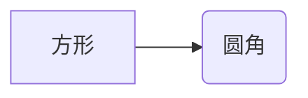
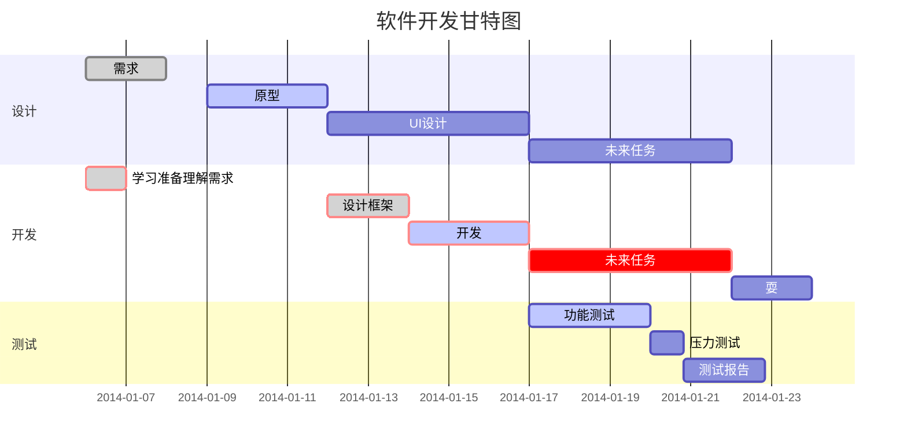

# hello
## hello world
* hello 
* hello world
> 区块引用
>> 嵌套引用

    void main ()
    {
        print("hello world");
    }
_斜体_ *hello*
__粗体__ **粗体**
___粗斜体___ ***粗斜体***  
- 第一
- 第二
* 第一
* 第二
+ 第一
+ 第二  
1. 第一项
    - 第一项嵌套第一个元素
    + 第一项嵌套第二个元素  
2. 第二项
    * 第二项嵌套第一个元素
    - 第二项嵌套第二个元素
3. 第三项
    + 第三
    * 第三

*****
[prethn repo](https://github.com/prethn/)

[prethn repo][1]
<!-- [1] 不能和前面代码连在一起！！ -->
[1]:https://github.com/prethn/
[img](/home/szu/图片/1.png)

\****

`ctrl+a`

你好  
你好  
你好  
~~你好~~  
~~你好~~  
<u> 带下划线文本 </u>  
<u> 带下划线文本 </u>  
创建脚注 [^菜鸟一枚]。  

[^菜鸟一枚]:--学的不是技术，更是梦想！  

--- 
-     -   -   
*   *   *   
***  
>最外层
>>第一层嵌套
>>>第二层嵌套
>>>>第三层嵌套  

>区块列表使用
>1. 第一项
>>    - hello
>>    - world
>2. 第二项
>3. 第三项  

- 第一项
    >学习 
    `printf()` 函数   
    >技术  
    >梦想  
- 第二项  
```c++
printf("hello, slam");
```
    printf("hello, slam");
<https://github.com/prethn>  
这个链接作为网址变量 [Google][google]

[google]: https://www.google.com.hk/
  
  
这是图片 ![1.png][1.png]  

[1.png]: https://github.com/prethn/rostest_y7000/blob/master_prethn/1.png  


| 表头 |表头|表头|  
| :----- |:-----:|----:|
|单元格|单元格|单元格|
|单元格|单元格|单元格|
|单元格|单元格|单元格|
|左对齐|居中对齐|右对齐|  
按下<kbd>Ctrl</kbd>+<kbd>Alt</kbd>+<kbd>Del</kbd>重启电脑
$$
\begin{Bmatrix}
a & b\\
c & d\\
\end{Bmatrix}
$$
$$
\begin{CD}
A @>a>>B\\
@VbVV @AAcA\\
C@=D
\end{CD}
$$
-----
-----

```flow
st=>start: 开始框
op=>operation: 处理框
cond=>condition: 判断框(是或否?)
sub1=>subroutine: 子流程
io=>inputoutput: 输入输出框
e=>end: 结束框
st->op->cond
cond(yes)->io->e
cond(no)->sub1(right)->op
```

